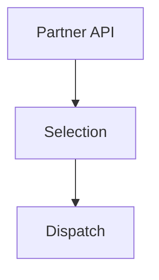

## The Challenge

Kroger had taken initial steps to integrate third-party fulfillment providers into their online grocery pickup orders. They had an initial solution to allow Instacart to submit orders after Instacart shoppers had already selected the items for the order, but the solution was buggy and data was at times being lost during integration. Kroger associates had to have Instacart software installed on their devices, which required contracts and risked security of internal devices from third-party code. They needed a way to integrate third-party fulfillment providers from the initial order process, and allow third parties to handle selection of items for an order. 

They needed a solution  without:
- Installing external software on internal systems
- Compromising security
- Disrupting existing operations

### Architecture Before

**Key Issues:**
1. Kroger generating Order data to back-fill data requirements
2. Unsure when Customer was coming, they just showed up
3. Third-Party Software installed on associate devices leading to security concerns
4. Not designed to scale to new partners

### Business Impact

The existing system could not support the growing demand for third-party delivery services, limiting revenue opportunities and customer satisfaction. We also needed to move third-party applications off of Kroger devices.
