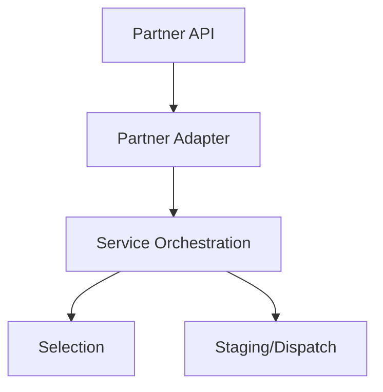

## My Solution

While the existing system worked for a limited amount of orders, I wanted to build a system that would work seamlessly with our rigid workflows, and plan to start diversifying our strategy into a series of orchestrations to allow third parties to take over any step of our fulfillment process, from ingesting orders from multiple sources, to allowing third parties to select the order, different parties to stage / destage orders, and not have to change business logic any time a new partner was added.
### Architecture

### Key Decisions

1. **Partner API** - To consolidate order data into a repeatable fashion to quickly bring in new third party providers
2. **Service Orchestration** - To treat each step in fulfillment as a piece that can be replaced by third parties, or non-human entities

### Technologies Used

- **Apache Kafka** - For messaging
- **Event-Driven Orchestration** - For event sequencing

## Services Performed

- Worked closely with Business, Product Designers and Product Managers to understand full set of needs from Partner orders, and ensure that requirements were documented to understand a Definition of Done
- Facilitated Event Storming workshops to quickly lay out paths of data flow to ensure we could identify all necessary interfaces between Instacart and Kroger
- C4 Modeling ensured responsible domains within Kroger understood what was to be built and how data would flow
- Coordinated a plan for development and provided guidance between 6 development teams
	- Kroger Commerce Platform
	- Selection (Cloud)
	- Seleciton (On-Prem)
	- Staging
	- Destaging / EPOS
	- Instacart development team
- Data Mapping sessions ensured each interface was sufficient to capture data necessary to fill all requirements
- Lead Failure Mode and Effects Analysis (FMEAs) with engineering teams to ensure we had an answer for any situation that could go wrong
- Presented plan to Architecture Review Board for approval
- Worked closely with Support team to understand details of new feature, and provide documentation for knowing when an error has occurred, how to check, and how to rectify