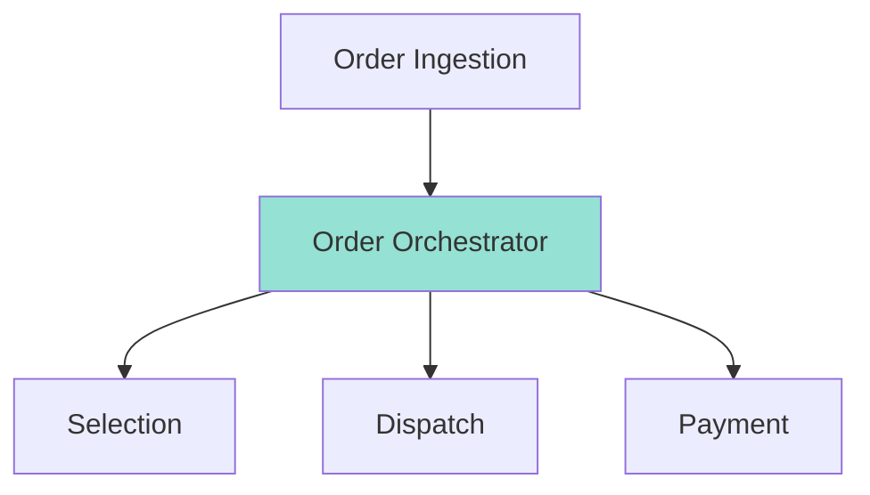

## My Solution

The system needed a modernization process. This took on many faces:

- Decouple Dispatch data from Selection data
- Refine the Domain responsibilities for Dispatch into a more defined bounded context
- Create an Orchestrator to handle how orders are fulfilled through a series of Work Orders
- Redefine what data Dispatch would be responsible for and what it stored
- Redesign Dispatch using an Event Sourcing pattern
- Refactor Dispatch code using CQRS
- Move Dispatch from on-prem SQL Server and Kafka to Azure CosmosDB and Azure Service Bus
- Generate outputs that would allow Data Engineers to consume Staging and Destaging Capacity data to input into ML/AI models for capacity prediction
### Architecture After

![[Experiences/Kroger/Staging Modernization/Updated Solution.canvas]]
### Key Decisions

1. **Domain Redefinition** - Dispatch removed the capabilities related to being a source of truth for containers. This now belonged solely with Selection.
2. **Event Sourcing Pattern** - Dispatch would not store relational data at all, and instead would use an Event Sourcing pattern to provide a ledger of container movement, and keep a current state of container locations
3. **Microservices Topology** - Dispatch would move off of an on-prem monolithic API with direct access to the database, to a CQRS pattern using microservices that could scale depending on necessary actions when needed.

### Technologies Used

- **Azure Service Bus** - For event messaging in Azure
- **Apache Kafka** - For duplicating necessary messages on-prem for systems that were not being migrated to Azure
- **CosmosDB** - For event storage, using the change feed as the event source stream
- **Azure Redis Cache** - To store current State of container locations as a Read Model
- **Azure Functions** - Deployed into Kubernetes cluster to handle APIs, persistence layers, event producers and consumers
## Services Performed

- Worked closely with Security team, partner Architect, and Product Managers to plan the modernization effort and to communicate new features unlocked with modernization
- Facilitated Event Storming workshops to lay out paths of data flow to ensure we could identify all necessary interfaces between Order Management, Selection, Dispatch and Payment teams
- Domain Analysis to ensure all capabilities were accounted for in their correct domain
- C4 Modeling ensured responsible domains within Kroger understood what was to be built and how data would flow
- Coordinated a plan for development and provided guidance between 5 development teams
	- Order Management
	- Selection (Cloud)
	- Seleciton (On-Prem)
	- Staging
	- Destaging / EPOS
- Data Mapping sessions ensured each interface was sufficient to capture data necessary to fill all requirements for all capabilities with no regression
- Lead Failure Mode and Effects Analysis (FMEAs) with engineering teams to ensure we had an answer for any situation that could go wrong
- Presented plan to Architecture Review Board for approval
- Worked closely with Support team to understand details of new features, and provide documentation for knowing when an error has occurred, how to check, and how to rectify