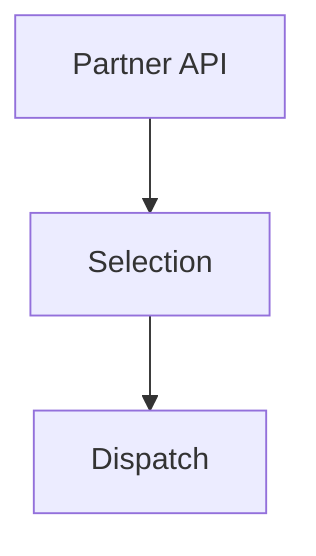

## The Challenge

Kroger had taken initial steps to integrate third-party fulfillment providers into their online grocery pickup orders. They had an initial solution to allow Instacart to submit orders after Instacart shoppers had already selected the items for the order, but the solution was buggy and data was at times being lost during integration.

Kroger associates had to have Instacart software installed on their devices, which required contracts and risked security of internal devices from third-party code. They needed a way to integrate third-party fulfillment providers from the initial order process, and allow third parties to handle selection of items for an order.

They needed a solution without:
- Installing external software on internal systems
- Compromising security
- Disrupting existing operations

### Architecture Before

**Key Issues:**
1. Kroger generating Order data to back-fill data requirements
2. Unsure when Customer was coming, they just showed up
3. Third-Party Software installed on associate devices leading to security concerns
4. Not designed to scale to new partners

### Business Impact

The existing system could not support the growing demand for third-party delivery services, limiting revenue opportunities and customer satisfaction. We also needed to move third-party applications off of Kroger devices.

## My Solution

While the existing system worked for a limited amount of orders, I wanted to build a system that would work seamlessly with our rigid workflows, and plan to start diversifying our strategy into a series of orchestrations to allow third parties to take over any step of our fulfillment process — from ingesting orders from multiple sources, to allowing third parties to select the order, different parties to stage / destage orders, without having to change business logic any time a new partner was added.

### Architecture

```mermaid
graph TD
    A[Partner API] --> B[Partner Adapter]
    B --> C[Service Orchestration]
    C --> D[Selection]
    C --> E[Staging/Dispatch]

    style A fill:#0A1628
    style B fill:#0A1628
    style C fill:#22D3EE
```

### Key Decisions

1. **Partner API** - To consolidate order data into a repeatable fashion to quickly bring in new third party providers
2. **Service Orchestration** - To treat each step in fulfillment as a piece that can be replaced by third parties, or non-human entities

### Services Performed

- Worked closely with Business, Product Designers and Product Managers to understand full set of needs from Partner orders
- Facilitated Event Storming workshops to quickly lay out paths of data flow to ensure we could identify all necessary interfaces between Instacart and Kroger
- C4 Modeling ensured responsible domains within Kroger understood what was to be built and how data would flow
- Coordinated a plan for development and provided guidance between 6 development teams
- Data Mapping sessions ensured each interface was sufficient to capture data necessary to fill all requirements
- Led Failure Mode and Effects Analysis (FMEAs) with engineering teams
- Presented plan to Architecture Review Board for approval
- Worked closely with Support team to provide documentation for error identification and remediation

## Results

### Deployment Success

- ✅ **1,100 stores** deployed in year one
- ✅ Expanding to **2,800 stores** in year two
- ✅ **$9M+ in new revenue** generated
- ✅ **Zero security incidents**

### Scalability Achieved

### Technical Wins

- **Introducing Orchestrations** enabled us to pivot away from rigid event workflows and tightly coupled domains into loosely coupled domains that could handle units of work as they are assigned
- **Real-time monitoring** with event monitoring
- **Easier Debugging** through splitting events into smaller logical steps

### Lessons Learned

1. **Start with events** - Event storming early in the process saved months of rework
2. **Security by design** - Removing codebases not under our control ensured data breaches were the sole responsibility of Kroger
3. **Partner collaboration** - Close work with Instacart ensured smooth integration
4. **Iterative approach** - Starting with limited stores allowed us to refine before scaling
