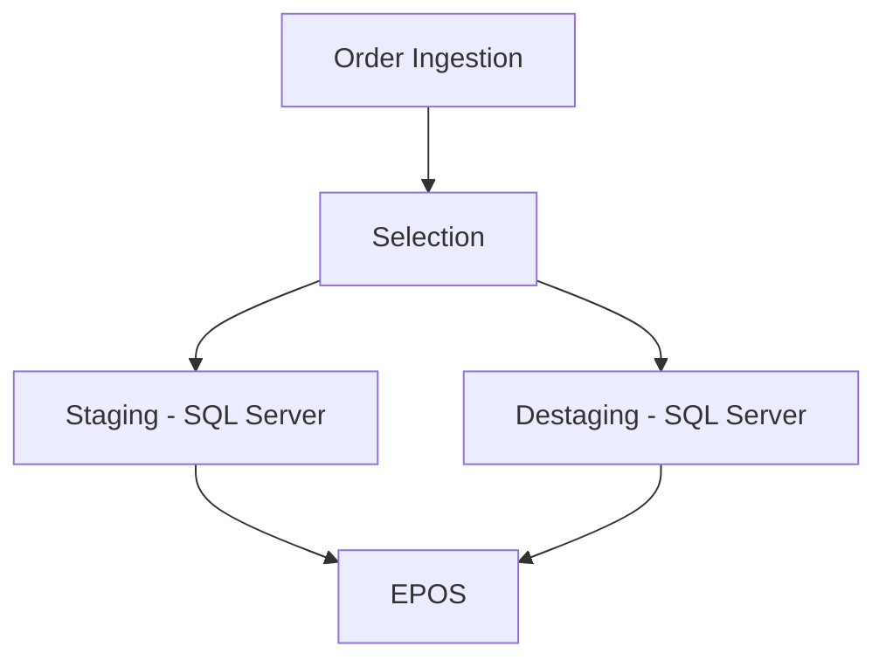

## The Challenge

Kroger's fulfillment systems were set up as a series of strict workflows, and had begun migrating toward Domain-Driven Design. The majority of their platform was on-prem, using a Kafka implementation and SQL Server for the vast majority of their data. They were looking to migrate to Azure, and wanted to be more agile in how they handled their order fulfillment.

The problems they faced related to Staging / Destaging:
- **Data duplication** — Selection would create containers to hold items, and Staging was recreating those containers to be its own source of truth
- **Hard-coded staging locations** meant many workarounds to add new staging features
- **Event playback was very difficult** and time consuming when issues arose
- **Third-party partners could not effectively stage orders** without using a Kroger device
- **Staging handling data that did not belong in the same domain**

### Architecture Before

**Key Issues:**
1. Data duplication led to consistency errors
2. Processes fired off events through rigid workflows unexpectedly
3. Event playback sometimes triggered workflows that impacted customer experience
4. Third-party partners could not effectively stage orders without a Kroger device
5. Staging handling data that did not belong in the same domain

### Business Impact

The existing system could not support new staging methodologies. Adding new methods of staging would take many months of development and workarounds, leading Kroger to abandon new features entirely.

## My Solution

The system needed a modernization process across multiple dimensions:

- Decouple Dispatch data from Selection data
- Refine the domain responsibilities for Dispatch into a more defined bounded context
- Create an Orchestrator to handle how orders are fulfilled through a series of Work Orders
- Redesign Dispatch using an Event Sourcing pattern
- Refactor Dispatch code using CQRS
- Move Dispatch from on-prem SQL Server and Kafka to Azure CosmosDB and Azure Service Bus
- Generate outputs to allow Data Engineers to consume Staging and Destaging capacity data for ML/AI capacity prediction models

### Architecture After

```mermaid
graph TD
    E[Order Ingestion] --> A[Order Orchestrator]
    A --> B[Selection]
    A --> C[Dispatch]
    A --> D[Payment]

    style A fill:#22D3EE
    style E fill:#0A1628
```

### Key Decisions

1. **Domain Redefinition** — Dispatch removed capabilities related to being a source of truth for containers. Container ownership now belonged solely with Selection.
2. **Event Sourcing Pattern** — Dispatch would not store relational data, instead using an Event Sourcing pattern to provide a ledger of container movement and current state of container locations.
3. **Microservices Topology** — Dispatch moved from an on-prem monolithic API to a CQRS pattern using microservices that could scale depending on load.

### Services Performed

- Worked closely with Security team, partner Architect, and Product Managers to plan the modernization effort
- Facilitated Event Storming workshops across Order Management, Selection, Dispatch and Payment teams
- Domain Analysis to ensure all capabilities were accounted for in their correct domain
- C4 Modeling ensured responsible domains understood what was to be built and how data would flow
- Coordinated development guidance across 5 teams: Order Management, Selection (Cloud), Selection (On-Prem), Staging, Destaging / EPOS
- Led Failure Mode and Effects Analysis (FMEAs) with engineering teams
- Presented plan to Architecture Review Board for approval

## Results

### Ease of Maintenance

- ✅ Educated teams in CQRS and Event Sourcing patterns
- ✅ New staging capabilities implemented seamlessly during development with no feature delays
- ✅ Backward compatibility ensured existing workflows were not interrupted as new stores migrated
- ✅ Feature flag deployment allowed new stores to adopt the platform with easy rollback

### Technical Wins

- **Event Sourcing** enabled replaying events to correct state without triggering workflows that impact customer communication
- **Domain Responsibility** was reestablished and documented to align with bounded contexts and committed domain capabilities
- **More Agile Feature Improvements** — looser coupling enabled third-party staging, non-human entity staging, and locker storage integration

### Lessons Learned

1. **Domain alignment is key** — Understanding which domain is responsible for which data was pivotal in ensuring teams knew exactly what to build
2. **Educating engineers can make or break the project** — Existing teams were not experienced in cloud technology, event sourcing, or CQRS. We balanced pragmatism with best practices to avoid overwhelming teams
3. **Iterative approach** — Piecing together this large project enabled quick pivots as budgets were reprioritized
